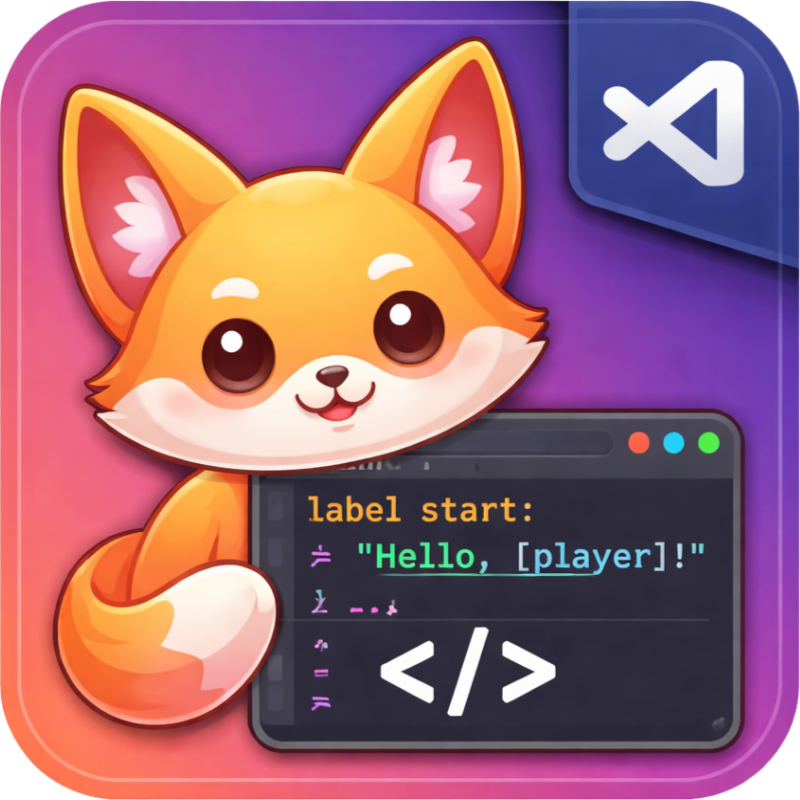

#  Ren'Py Language Support

A Visual Studio Code extension that adds rich language support for the Ren’Py visual novel engine.

I originally made this for myself after running into a few small annoyances with existing extensions — mainly wanting to jump to symbols with `Cmd+R`, check whether an image reference actually exists, and jump to image definitions with `F12`.

I kept adding things as I needed them while working on projects, and over time it just grew into something more complete. It’s still very much shaped by what I personally find useful, but it might be helpful to others too. It's powered by a proper language server (LSP), which makes features like navigation, diagnostics, and completions more consistent and reliable.

## ✨ Features

### 🎨 Syntax Highlighting

* Full highlighting for `.rpy` and `.rpym` files
* Supports:

  * Ren’Py script syntax
  * ATL (Animation and Transformation Language)
  * Embedded Python blocks
* Highlights string interpolation and text tags inside dialogue

### 📖 Hover Documentation

* Hover over keywords, functions, and classes to view inline documentation
* Covers **730+ API entries** sourced from official Ren’Py docs:

| Category             | Entries | Examples                             |
| -------------------- | ------- | ------------------------------------ |
| `config.*`           | 286     | `config.name`, `config.screen_width` |
| `gui.*`              | 107     | `gui.text_color`, `gui.show_name`    |
| `build.*`            | 18      | `build.name`, `build.directory_name` |
| Actions              | 47      | `Jump`, `Call`, `Show`, `Hide`       |
| Style properties     | 129     | `background`, `padding`, `color`     |
| Transform properties | 52      | `xpos`, `ypos`, `zoom`, `alpha`      |

Also includes:

* Classes and transitions (`Transform`, `Dissolve`, `Fade`, etc.)
* Full support for dotted names (e.g. `config.name`)

### 🔎 Navigation & Code Intelligence

#### Go to Symbol (`Cmd+Shift+O` / `Ctrl+Shift+O`)

Jump to:

* Labels (including local labels like `.label`)
* Screens
* Transforms
* Images
* Styles, defines, defaults, layeredimages

#### Workspace Symbol Search (`Cmd+T` / `Ctrl+T`)

Search across all `.rpy` files:

* Labels, screens, images
* Python functions and classes

#### Go to Definition (`F12`)

Navigate directly to definitions of:

* Labels (`jump`, `call`)
* Screens (`show screen`, `call screen`, `use`)
* Images (`show`, `scene`, `hide`)
* Transforms and variables

✔ Handles Ren’Py’s flexible image naming (space-separated names)

### 🔁 Refactoring Tools

#### Find All References (`Shift+F12`)

* Locate all usages of labels, screens, images, and variables

#### Rename Symbol (`F2`)

* Rename labels, screens, and variables
* Automatically updates all references across the workspace

### ⚡ Intelligent Completions

Context-aware suggestions for:

* Ren’Py keywords and statements
* ATL syntax
* Transform and style properties
* Screen properties and `style_prefix` values
* Transitions (after `with`)
* Labels and screens in relevant contexts
* Built-in Ren’Py API

**Namespace support**

* Type `config.`, `gui.`, or `build.` to browse all variables

**Smart behaviour**

* Suppresses suggestions after assignments like `config.xxx =`

### ✍️ Signature Help

Inline parameter hints for 60+ functions, including:

* Transitions: `Dissolve()`, `Fade()`, `ImageDissolve()`
* Displayables: `Character()`, `Transform()`, `Text()`
* Actions: `Jump()`, `Call()`, `SetVariable()`
* `renpy.*` APIs (`renpy.pause()`, `renpy.show()`, etc.)
* Audio APIs: `renpy.music.*`, `renpy.sound.*`
* Image tools: `im.Composite()`, `LiveComposite()`

### ⚠️ Diagnostics

Real-time feedback with:

**Warnings**

* Undefined labels (`jump`, `call`)
* Undefined local labels (`.label`)
* Missing screens (`call screen`, `show screen`, `use`)

**Errors**

* Mismatched quotes (including triple-quoted strings)

**Built-in awareness**

* Screens: `save`, `load`, `preferences`, `main_menu`, etc.
* Images: `black`, `white`, `transparent`

✔ Ignores comments and multiline strings correctly

## 🚀 Installation

### From Source (Development)

```bash
git clone <repo-url>
cd <repo-folder>
npm install
npm run compile
```

Then press `F5` in VS Code to launch the Extension Development Host.

## 🧪 Usage

1. Open a folder containing `.rpy` files
2. Open any Ren’Py file
3. The extension activates automatically

> ⚠️ If you have another Ren’Py extension installed, disable it to avoid conflicts

## 🛠 Development

### Running Tests

```bash
npm test
```

Tests include:

* Syntax pattern matching (labels, screens, images, comments)
* Completion logic and suppression rules
* Hover documentation lookup
* Symbol extraction and indexing
* API data validation

### Updating API Data

```bash
npm run fetch-api
npm run compile
```

This pulls documentation from Ren’Py source and RST files, generating:

```
src/server/renpy-api.json
```

## ⚠️ Known Limitations

* Embedded Python does not use a full Python language server
* Image validation only covers code-defined images
* Local labels are validated per file (not across files)

## 📋 Requirements

* VS Code **1.75.0+**
* No external runtime dependencies (pure TypeScript implementation)

## 📄 License

MIT
